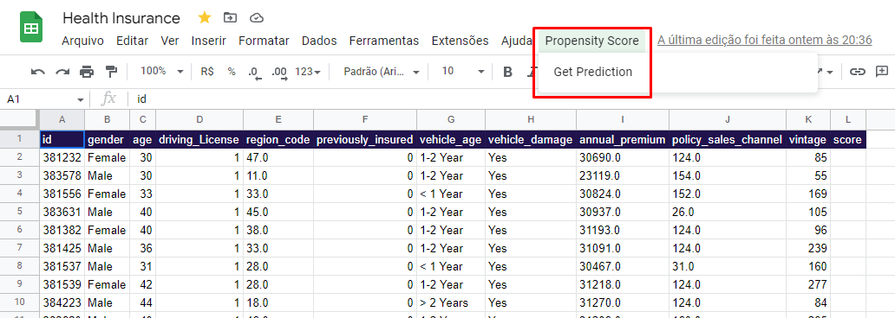

# Cross Sell - Rank to learn

# 1. Business Problem.

## 1.1 O que é Cross-sell?
 A prática de venda cruzada constitui em oferecer um novo produto complementar ao anterior, esta prática de marketing amplamente utilizada promove aos clientes da empresa um novo produto relacionado ou complementar, é importante não confundir com venda cruzada onde ambos os produtos são vendidos obrigatoriamente atrelados um ao outro, prática ilítica no Brasil.
 O método de Cross-sell é uma excelente opção de marketing muito difundida no mercado financeiro sendo considerada uma das melhores maneiras de crescimento da empresa, entretanto é necessário grande habilidade nas negociações e principalmente conhecimento do perfil de cada cliente.

## 1.2 A empresa Insurance All
A Insurance All é uma empresa que fornece seguro de saúde para seus clientes e o time de produtos está analisando a possibilidade de oferecer aos assegurados, um novo produto: Um seguro de automóveis.

Assim como o seguro de saúde, os clientes desse novo plano de seguro de automóveis precisam pagar um valor anualmente à Insurance All para obter um valor assegurado pela empresa, destinado aos custos de um eventual acidente ou dano ao veículo.

A Insurance All fez uma pesquisa com cerca de 380 mil clientes sobre o interesse em aderir a um novo produto de seguro de automóveis, no ano passado. Todos os clientes demonstraram interesse ou não em adquirir o seguro de automóvel e essas respostas ficaram salvas em um banco de dados junto com outros atributos dos clientes.

O time de produtos precisa selecionar novos clientes que não responderam a pesquisa para participar de uma campanha, no qual receberão a oferta do novo produto de seguro de automóveis. A oferta será feita pelo time de vendas através de ligações telefônicas. Contudo, o time de vendas tem uma capacidade de realizar 20 mil ligações dentro do período da campanha.

Portanto desenvolvi análises e modelos que classifiquem os clientes em interessados ou não e os ordenem pelos mais propensos a aceitar a oferta, também disponibilizo a ferramenta no Google Sheets para que o time de vendas possa filtrar os clientes.

# 2. Business Assumptions.
Com base em pesquisa de mercado foram tomadas as seguintes suposições de negócio:

- A empresa atua na India, portanto os valores e padrões refletem o local.
- O valor anual do seguro de saúde pago pelo cliente na Indía será em média Rs 40.000,00 e portanto valores acima de 65.000,00 serão tratados como extremos.
- Seguros de veículos são obrigatórios por lei.
- Seguros de veículos não possuem tempo mínimo de carência.

# 3. Solution Strategy

A empresa Insurance All possui orçamento ou/e limite de equipe para realizar a oferta do novo produto, portanto preciso entregar a melhor solução que possa otimizar o custo da ligação e trazer retorno imediato.

Para resolver o problema de negócio utilizo da metodologia CRISP-DM adaptada para os processos de ciência de dados, as etapas de processos para a solução serão as seguintes:

Utilizei os seguintes princípios da metodologia:

**Step 01. Data Description:** Coleto os dados a partir de um Banco de dados e realizo uma breve análise e suas estatísticas, também limpo alguns dados com potenciais comprometedoras, o meu objetivo se concentra está em ganhar conhecimento inicial do problema em que estou lidando e começar a planejar quais ferramentas devo utilizar na manipulação para os algorítmos.

**Step 02. Feature Engineering:** Desenvolvo hipóteses iniciais sobre o negócio para poder derivar novos atributos com base nas variáveis originais para descrever melhor o fenômeno a ser compreendido, estes atributos podem me auxiliar na validação de hipóteses e no treinamento do modelo de Machine Learning.

**Step 03. Data Filtering:** Nesta etapa busco remover algumas variáveis criadas para auxiliar o processo de Feature Engineering, também altero as seguintes colunas:
- Seleciono apenas pagamentos de seguros abaixo de Rs 65.000,00 anual, considerando os acima como fora do escopo de negócio da empresa.
- Desconsidero clientes que não possuem habilitação para veículos, embora possa haver interessados em seguro de automóvel não representarão ganhos imediatos para a empresa.

**Step 04. Exploratory Data Analysis:** A partir das hipóteses geradas na etapa 02 exploro os dados para encontrar insights e entender melhor o impacto das variáveis, também busco compreender o comportamento de cada variável e suas correlações com as demais.

**Step 05. Data Preparation:** Neste processo utilizo das técnicas de preparação dos dados de categóricos para numéricos e também implemento reescalas, por fim realizo o balanceamento dos dados, esses processos visam entregar melhor qualidade para o treinamento dos modelos de Machine Learning.

**Step 06. Feature Selection:** Nessa etapa utilizo dos algoritmos Boruta e das árvores de decisões para selecionar as melhores variáveis a um treinamento de Machine Learning, também valido a escolha das variáveis com o conhecimento adquirido na exploração de dados.

**Step 07. Machine Learning Modelling:** Nesta etapa testo diferentes modelos para verificar o comportamento dos meus dados (lineares/não lineares) e utilizo aquele que demonstrar melhor performance em aprendizado e generalização.

**Step 08. Hyperparameter Fine Tunning:** Com o objetivo de otimizar o LGBM utilizo da técnica de Bayesian Search para encontrar os melhores parâmetros do Modelo de Machine Learning.

**Step 09. Convert Model Performance to Business Values:** Nesta etapa demonstro por gráficos e textos a expectativa de clientes e de ganhos financeiros com base no problema de negócio, também acresento previsões com base em outras decisões de negócio como dobrar o número de ligações ou atingir 80% dos interessados.

**Step 10. Deploy Modelo to Production:** Nesta etapa entendo que o projeto entregou resultado satisfatório e disponibilizo para a equipe via planilha os clientes ordenados pela propensão a aceitar o novo seguro, também acresento uma ferramenta no Google Sheets onde a equipe poderá cadastrar novos clientes e solicitar predições em tempo real.

# 4. Top 3 Data Insights

**Hypothesis 01:** Pessoas com carros comprados recentemente possuem maior interesse em seguro

**False.** No primeiro gráfico temos grande concentração dos interessados entre 1 a 2 anos, já no segundo conseguimos perceber a relação de crescimento de interesse através dos anos representado pela cor azul.

**Hypothesis 02:** Pessoas mais velhas possuem maior interesse em seguro

**False.** O primeiro gráfico demonstra a quantidade de votos absoluto por idade, o que nos dá um indício que não há muitos votos de pessoas mais velhas, já no segundo gráficos observamos a quantidade de votos percentuais que confirma a predominancia do interesse em seguro entre 30 a 40 anos. O terceiro gráfico demonstra a maior concentração dos interessados próximo da faixa de 40 anos, frente a 30 anos dos não interessados, já o quarto gráfico confirma uma correlação negativa (quanto maior a idade menor o interesse).
A conclusão registrada é que pessoas mais velhas possuem menor interesse, portanto hipótese falsa.

**Hypothesis 03:** Pessoas em diferentes regiões possuem maior interesse em seguro

**True.** O primeiro gráfico corresponde a diferentes regiões por quantidade de votos, embora não haja informação da região em exato é possível extrair a informação de maior interesse em diferentes regiões.

# 5. Machine Learning Model Applied

Os testes ocorreram com os seguintes algoritmos e suas respectivas performances com Cross-validation:

| Model Name | Precision at k | recall at k |
|------------|-----|------|
| XGBoost | 0.994+/-0.001 | 0.854+/-0.001 |
| LGBM | 0.990+/-0.001 | 0.850+/-0.001 |
| Balanced Random Forest | 0.972+/-0.001 | 0.802+/-0.001 |
| Extra Trees | 0.964+/-0.001 | 0.828+/-0.001 |
| K-Nearest Neighbors | 0.871+/-0.011 |	0.748+/-0.009 |
| Logistic Regression | 0.774+/-0.001 |	0.665+/-0.001 |
    
Os melhores modelos foram os da família de árvore como o XGBoost e o LGBM, também utilizo o Balanced Random Forest para testar a performance do modelo em balancear os dados, devido a performance similar decido utilizar o LGBM pela a sua velocidade e pouco uso de memória, por último o modelo é otimizado através do Bayesian Search.

# 6. Business Results

As performances a seguir serão construidas em dados de teste representado 74.487 clientes, deste 9010 são interessado em seguro.

Estabeleço as seguindos métricas:
- O ticket anual para o seguro de carro no valor de Rs 4.273,83
- Todos os 9010 interessados estarão aceitando o novo produto.

## No problema estabelecido de 20.000 ligações teremos:

Ligações aleatória:
 - O time alcança 27% dos interessados, representa uma receita anual de Rs 10.34M (Linha preta pontilhada).

Ordenação do algoritmo:
 - O time alcança 72% dos interessados, representa uma receita anual de Rs 27.54M (Linha azul).

A implementação do modelo representa um aumento de 2.66 vezes a receita esperada, uma diferença de Rs 17.2M.

## 40.000 ligações

Também gostaria de observar algumas possibilidades como dobrar o número de ligações

Ligações aleatória:
 - O time alcança 54% dos interessados, representa uma receita anual de Rs 20.68M.

Ordenação do algoritmo:
 - O time alcança 100% dos interessados, representa uma receita anual de Rs 38.37M.

A implementação do modelo representa um aumento de 1.86 vezes a receita esperada, uma diferença de Rs 17.7M.

## 80% dos interessados (23.300 ligações)

Ligações aleatória:
 - O time alcança 31% dos interessados, representa uma receita anual de Rs 12.04M.

Ordenação do algoritmo:
 - O time alcança 80% dos interessados, representa uma receita anual de Rs 30.75M.

A implementação do modelo representa um aumento de 2.55 vezes a receita esperada, uma diferença de Rs 18.71M.

## 6.1 Deploy model to Google Sheets

Finalizo o projeto disponibilizando o acesso as predições do modelos no Google planilhas onde permite a equipe preencher novos clientes e verificar sua propenção ao novo produto [Acesso a planilha](https://docs.google.com/spreadsheets/d/1SRCt2r6zaFXkofO31sSk-nQJMJmJoTolRJBZgAKsntU/edit?usp=sharing).

# 7. Lessons Learned

- **Balanceamento:** O desbalanceamento dos dados podem causar grandes impactos no aprendizado do modelo, para evitar o viés compreendi sobre balanceamento de dados e balanceamento no próprio modelo, na prática os dados tendem a serem desbalanceados o que soma a um grande aprendizado.
- **Métricas:** Problemas Rank to learn envolvem outras métricas e o desbalanceamento dos dados também, trabalhar com esses fatores trouxe grande entendimento sobre como observar a performance do modelo e como mensurar o resultado financeiro.
- **Organização de projetos:** Implementei uma nova estrutura de pastas e arquivos para o projeto que visam organização e facilidade em localizar, é importante trabalhar essa etapa para evitar problemas com grandes projetos.
- **Entendimento do negócio:** A maior habilidade que atribuo a este projeto foi o tempo e conhecimento necessários para entender o modelo de negócio e trabalhar com o projeto ponta a ponta focado na visão financeira, definitivamente trás novas abordagens que fazem mais sentido para a realidade da empresa.

# 8. Next Steps to Improve

- **Feature Engineering:** Este problema possui poucas features a serem exploradas, trabalhar em novas features certamente trará resultados.
- **Análise exploratória de dados:** uma exploração detalhada nas principais variáveis que impactam o modelo, mas principalmente novos Insights através das hipóteses.
- **Precisão dos modelos:** Observar os principais erros nas predições e entender o porque, também testar novos modelos com foco em minimizar os falsos positivos e negativos.

# LICENSE

# All Rights Reserved - Comunidade DS 2022
